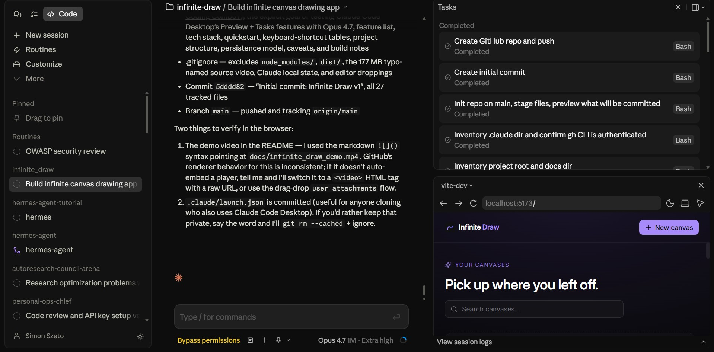

# Infinite Draw

An infinite-canvas drawing and diagramming app — shapes, arrows that connect them, freehand ink, text, a searchable Lucide icon library, PNG export, and clipboard-paste for screenshots. All projects are stored locally in IndexedDB.



**Demo video** — every feature in action:

https://github.com/user-attachments/assets/44f7656a-9846-4a57-a05e-79368f6c375c

---

## Why this project exists

This project was inspired by the YouTube video **[Opus 4.7 + Claude Code Desktop = Best Agentic Coding Combo?](https://www.youtube.com/watch?v=BV9Bnj3l8pk)**.

The goal is to replicate the "Infinite Draw" app demoed in that video as a small but honest test of two things:

1. **Claude Code Desktop features** — specifically the **Preview** server integration (live browser + console logs + DOM inspection) and **Tasks** orchestration, used throughout the build for verification-in-the-loop rather than guessing.
2. **Claude Opus 4.7 coding capabilities** — one-shot spec → scaffold → working feature-complete app, with a human in the loop only for architectural choices and final polish.

The entire project was built in a single Claude Code session. See [Build notes](#build-notes) below for what actually happened.

---

## Features

| | |
|---|---|
| 🎨 **Infinite canvas** with pan, zoom, and all the basic shapes (rect, ellipse, line, arrow, freehand, text) | Powered by the [`tldraw`](https://tldraw.dev) SDK |
| 🔗 **Arrows that snap to shapes** — true diagramming, not just overlaid lines | Native tldraw binding |
| 🎯 **Lucide icon library** — 1,534 icons (popular 103 shown first, everything searchable) dropped onto the canvas as first-class shapes: resize with aspect-ratio lock, and recolor via the same tldraw color picker used for every other shape | Custom `IconShape` registered with `DefaultColorStyle` |
| 📐 **Diagram templates** — 8 ready-made starters (flowchart, sequence, system architecture, microservices, mind map, kanban, org chart, SWOT) dropped at viewport center with arrow bindings pre-wired, so connectors stay attached as you move pieces. The whole template is inserted in a single `editor.run()` — `Ctrl+Z` removes it atomically | `src/templates/`, `TemplatePickerModal` |
| 🖼️ **Paste screenshots** straight from the clipboard | Native `ClipboardEvent` → tldraw image shape |
| 💾 **Multi-project** home screen — grid of project cards with live thumbnails, inline rename, delete, and a search box | IndexedDB via [Dexie](https://dexie.org) |
| ✏️ **Inline canvas rename** — click the project title in the canvas top bar to rename in place | — |
| 💡 **Autosave with a live status pill** (`Saving…` → `Saved`) and toast feedback on inserts and exports | 700 ms debounced Dexie writes |
| 📤 **PNG export** — full page or selection, 2× scale, with a download-filename derived from the project name | `editor.toImage()` |
| ⌨️ **Power-user shortcuts** for every feature, with a `?` cheat-sheet overlay | Layered over tldraw's own keymap |
| 🌒 **Dark-first, trendy UI** | Tailwind, Inter, zinc/violet palette |

All data lives on your device. There is no backend, no account, no sync.

---

## Quick start

**Requirements:** Node.js ≥ 18 and npm.

```bash
git clone https://github.com/az9713/infinite-draw.git
cd infinite-draw
npm install
npm run dev
```

The dev server prints a URL (default `http://localhost:5173`). Open it in any Chromium or Firefox-based browser.

### Other scripts

| Script | What it does |
|---|---|
| `npm run dev` | Vite dev server with HMR on port 5173 |
| `npm run build` | Type-check then produce a production bundle in `dist/` |
| `npm run preview` | Serve the production build on port 4173 |
| `npm run typecheck` | Run TypeScript without emitting |

---

## Keyboard shortcuts

App-specific:

| Key | Action |
|---|---|
| `N` | New canvas (on Home) |
| `I` | Open icon picker |
| `P` | Open diagram-template picker |
| `?` | Toggle the keyboard cheat-sheet |
| `⌘/Ctrl + E` | Export current page as PNG |
| `⌘/Ctrl + Shift + E` | Export current selection as PNG |
| `Esc` | Close any overlay |

Inherited from tldraw (abridged):

| Key | Action |
|---|---|
| `V` | Select |
| `H` | Hand / pan |
| `D` | Draw / ink |
| `R` | Rectangle |
| `O` | Ellipse / circle |
| `A` | Arrow (connects shapes) |
| `L` | Line |
| `T` | Text |
| `E` | Eraser |
| `⌘/Ctrl + V` | Paste (text, shapes, or a screenshot image) |
| `⌘/Ctrl + Z` / `Shift+Z` | Undo / redo |

Press `?` inside the app for the full list.

---

## Tech stack

- **React 18** + **TypeScript** + **Vite 5**
- **[tldraw](https://tldraw.dev) v3** — the canvas engine
- **[Dexie](https://dexie.org) v4** — IndexedDB wrapper, one row per project
- **[React Router](https://reactrouter.com) v6** — `/` (home) and `/c/:projectId` (canvas)
- **[lucide-react](https://lucide.dev)** — all 1,534 icons, deduped by component identity
- **Tailwind CSS v3** — dark-first, zinc/violet palette, Inter font via rsms.me
- **nanoid** for short project IDs

Bundle weighs ~2.6 MB uncompressed / ~712 KB gzipped — mostly tldraw and the static Lucide import. Acceptable for a local app.

---

## Project structure

```
infinite_draw/
├── src/
│   ├── main.tsx              # Router setup
│   ├── App.tsx               # Root layout
│   ├── db.ts                 # Dexie schema: `projects` table
│   ├── lib/
│   │   └── projects.ts       # CRUD over projects
│   ├── icons/
│   │   └── lucide-catalog.ts # Deduped Lucide catalog + resolver
│   ├── shapes/
│   │   └── IconShapeUtil.tsx # Custom tldraw shape for Lucide icons
│   ├── templates/            # Diagram-template library (see below)
│   │   ├── index.ts          # Exported catalog
│   │   ├── types.ts          # DiagramTemplate, BuildContext, etc.
│   │   ├── helpers.ts        # Shape/arrow factories used by templates
│   │   ├── flowchart.tsx
│   │   ├── sequence.tsx
│   │   ├── system-arch.tsx
│   │   ├── microservices.tsx
│   │   ├── mindmap.tsx
│   │   ├── kanban.tsx
│   │   ├── org-chart.tsx
│   │   └── swot.tsx
│   ├── components/
│   │   ├── Logo.tsx
│   │   ├── IconPickerModal.tsx
│   │   ├── TemplatePickerModal.tsx
│   │   └── CheatSheet.tsx
│   └── routes/
│       ├── HomePage.tsx      # Project grid
│       └── CanvasPage.tsx    # tldraw + toolbar overlay
├── docs/
│   ├── claude_code_desktop.jpg  # README hero: Tasks + Preview panels
│   └── infinite_draw_demo.mp4   # Full feature walkthrough
├── .claude/
│   └── launch.json           # Claude Code Desktop dev-server config
└── ... (standard Vite/Tailwind config)
```

**Adding a template:** implement the `DiagramTemplate` interface from `src/templates/types.ts` (id, name, description, category, `preview()`, `build({ center, newId })`), then add it to the exported `TEMPLATE_CATALOG` in `src/templates/index.ts`. The shared factories in `helpers.ts` cover rectangles, rounded cards, ellipses, arrows with bindings, and icon shapes — most new templates are under 100 lines.

---

## Persistence model

Each project is a single row in the `projects` IndexedDB table:

```ts
interface Project {
  id: string          // 10-char nanoid
  name: string
  createdAt: number
  updatedAt: number
  snapshot: unknown   // Full tldraw store snapshot
  thumbnail: string | null  // PNG data URL (~8 KB)
}
```

The canvas autosaves on every document mutation, debounced at 700 ms. On each save, tldraw's `editor.toImage()` renders a 0.5× PNG thumbnail that the Home grid displays. A `beforeunload` listener flushes a synchronous snapshot-only save if you close the tab mid-edit, and React Router unmounts run a final full flush (snapshot + thumbnail) before navigation.

The live `Saving…` / `Saved` pill in the canvas top bar reflects this pipeline directly, so you can always tell whether your work is persisted.

There are no migrations today. If the `IconShape` schema ever changes, old snapshots will fail validation — plan to add a `ShapeUtil.migrations` entry at that point.

---

## Known caveats

- **tldraw watermark.** The bottom-right "made with TLDRAW" mark is part of tldraw's free tier and can only be removed with a commercial license.
- **Static Lucide import.** All 1,534 icons load eagerly so the picker is instant. If this ever matters, swap to `dynamicIconImports` with `React.Suspense`.
- **Local-only.** No sync, no sharing. Clearing browser storage clears your canvases.

---

## Build notes

For anyone curious how this came together in a single Claude Code / Opus 4.7 session:

- **Architecture decision up front.** Brainstorming-mode dialogue settled the biggest question — build the canvas engine from scratch vs. use tldraw — before a line of code. Going with tldraw turned a weeks-long build into an afternoon.
- **Pass 1 → Pass 2 discipline.** Skeleton first (Home + Canvas + autosave + dark theme), verified end-to-end in-browser via Claude Code Desktop's Preview tool, then Pass 2 features (icon picker, shortcuts, export, thumbnails, cheat-sheet) layered on.
- **Verification in the loop.** Every feature was confirmed with a real browser screenshot, DOM inspection, or an IndexedDB readout — not "looks right to me".
- **Advisor review near the end** caught two real bugs: icon color wasn't wired to tldraw's `DefaultColorStyle` (so the color picker silently no-op'd on icons), and the Lucide catalog was showing 3,461 icons because aliases weren't deduped. Both fixed before declaring done.

---

## License

MIT, free to fork, remix, and learn from. The `tldraw` SDK itself is MIT with the watermark requirement noted above.

The **[Opus 4.7 + Claude Code Desktop](https://www.youtube.com/watch?v=BV9Bnj3l8pk)** video that inspired this belongs to its author — full credit for the idea.
